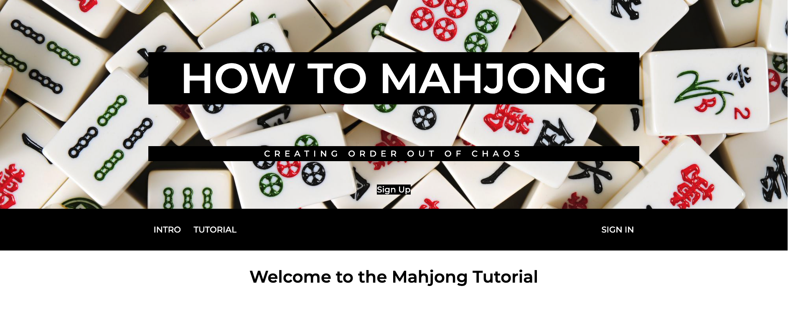

# How to Mahjong

## Web Application Purpose and Assessement Mechanism
This web application provides an introduction and tutorial about Mahjong which is a tile-based game and also a formative assessement quiz for users to test their understanding of this game. The Formative assessement is consists of 10 multiple choice questions and one score for each question. Users can view their quiz history with average score and times they have done the quiz, as well as feedback for the questions they have done wrong.

## The Architecture of the Web Application
This application is constists of 6 modules: Sign In/Sign Up, Introduction, Tutorial, Quiz, History and Feedback. Users can view content of Introduction and   Tutorial, and required to login to take quiz, see history and feedback as these section are related to individual user.

## Getting Started
To activate python virtual environment: `$source venv\bin\activate`  
To run the app: `$python run.py`  
To stop the app: `$ctrl c`  
Te deactivate virtual environment: `$deactivate`  

## Unit tests
FormCase tests all the form's submission, including login, registration and quiz.  
ModelsCase tests funcitons in the models.py, including get user history and feedback, etc.  
To run unit tests: `python tests.py`

## Note
This project is done by Harper Wu (Backend) and Ethan Chen (Frontend).

## Screenshots

